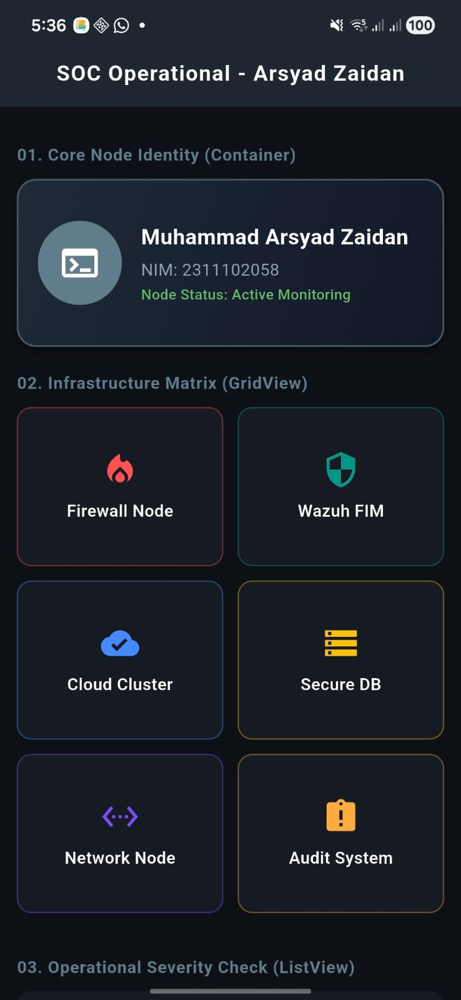
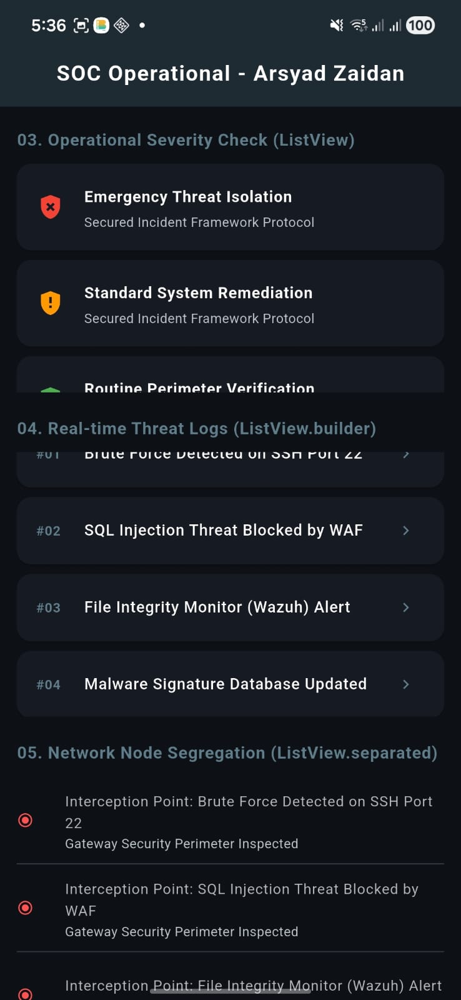
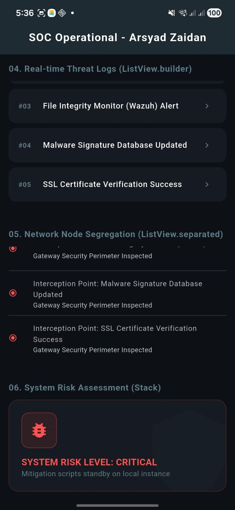

<div align="center">
  <br />
  <h1>LAPORAN PRAKTIKUM<br>APLIKASI BERBASIS PLATFORM</h1>
  <br />
  <h3>PERTEMUAN 9 - MOBILE (WIDGET LAYOUTING)</h3>
  <br />
   
  <br />
  <h3>Disusun Oleh :</h3>
  <p>
    <strong>Muhammad Arsyad Zaidan</strong><br>
    <strong>2311102058</strong><br>
    <strong>S1IF-11-REG04</strong>
  </p>
  <br />
  <h3>Dosen Pengampu :</h3>
  <p>
    <strong>Cahyo Prihantoro, S.Kom., M.Eng</strong>
  </p>
  <br />
    <h4>Asisten Praktikum :</h4>
    <strong>Gilang Saputra</strong> <br>
    <strong>Rangga Pradarrell Fathi</strong>
  <br />
  <h3>LABORATORIUM HIGH PERFORMANCE
 <br>PROGRAM STUDI TEKNIK INFORMATIKA<br>FAKULTAS INFORMATIKA<br>UNIVERSITAS TELKOM PURWOKERTO<br>2026</h3>
</div>

---

## LINK REPOSITORI GIT
<a href="https://github.com/marsyadzaidan/TugasABPTugas-Laprak_2311102058.git">
   https://github.com/marsyadzaidan/TugasABPTugas-Laprak_2311102058.git
</a>

---

## JAWABAN REKAYASA KODE

### 1. Container Widget



**Analisis:** `Container` digunakan sebagai wadah identitas utama. Dengan properti `BoxDecoration` dan `LinearGradient`, tampilan kartu dibuat memiliki dimensi yang lebih modern dan selaras dengan tema *dark mode*.

### 2. GridView Widget



**Analisis:** Menggunakan `GridView.builder` dengan `SliverGridDelegateWithFixedCrossAxisCount` untuk menyusun item infrastruktur secara simetris dalam format 2 kolom, memberikan efisiensi ruang pandang pada layar aplikasi.

### 3. ListView & Stack Widget



**Analisis:** Bagian ini mencakup `ListView` statis untuk *Severity Check* serta `Stack` yang diterapkan untuk membuat *overlay* peringatan kritis (*System Risk Assessment*), memberikan indikasi visual yang tajam mengenai level risiko sistem.

---

### Source Code `main.dart`
```dart
import 'package:flutter/material.dart';

void main() {
  runApp(const SecurityCenterApp());
}

class SecurityCenterApp extends StatelessWidget {
  const SecurityCenterApp({super.key});

  @override
  Widget build(BuildContext context) {
    return MaterialApp(
      debugShowCheckedModeBanner: false,
      title: 'InfoSec Operational Center',
      theme: ThemeData(
        colorScheme: ColorScheme.fromSeed(
          seedColor: Colors.blueGrey,
          brightness: Brightness.dark,
        ),
        useMaterial3: true,
      ),
      home: const DashboardPage(),
    );
  }
}

class DashboardPage extends StatelessWidget {
  const DashboardPage({super.key});

  final List<String> logsKeamanan = const [
    'Brute Force Detected on SSH Port 22',
    'SQL Injection Threat Blocked by WAF',
    'File Integrity Monitor (Wazuh) Alert',
    'Malware Signature Database Updated',
    'SSL Certificate Verification Success',
  ];

  final List<Map<String, dynamic>> fungsiSecurity = const [
    {'title': 'Firewall Node', 'icon': Icons.local_fire_department, 'color': Colors.redAccent},
    {'title': 'Wazuh FIM', 'icon': Icons.security, 'color': Colors.teal},
    {'title': 'Cloud Cluster', 'icon': Icons.cloud_done, 'color': Colors.blueAccent},
    {'title': 'Secure DB', 'icon': Icons.storage, 'color': Colors.amber},
    {'title': 'Network Node', 'icon': Icons.settings_ethernet, 'color': Colors.deepPurpleAccent},
    {'title': 'Audit System', 'icon': Icons.assignment_late, 'color': Colors.orangeAccent},
  ];

  @override
  Widget build(BuildContext context) {
    return Scaffold(
      backgroundColor: const Color(0xff0d1117),
      appBar: AppBar(
        title: const Text(
          'SOC Operational - Arsyad Zaidan',
          style: TextStyle(fontWeight: FontWeight.bold, letterSpacing: 0.8, fontSize: 18),
        ),
        centerTitle: true,
        backgroundColor: const Color(0xff161b22),
        foregroundColor: Colors.white,
        elevation: 2,
      ),
      body: SingleChildScrollView(
        padding: const EdgeInsets.symmetric(horizontal: 14, vertical: 10),
        child: Column(
          crossAxisAlignment: CrossAxisAlignment.start,
          children: [
            subJudulSection('01. Core Node Identity (Container)'),
            Container(
              height: 140,
              width: double.infinity,
              decoration: BoxDecoration(
                gradient: const LinearGradient(
                  colors: [Color(0xff1f2937), Color(0xff111827)],
                  begin: Alignment.topLeft,
                  end: Alignment.bottomRight,
                ),
                borderRadius: BorderRadius.circular(16),
                border: Border.all(color: Colors.blueGrey.shade700, width: 1.5),
                boxShadow: [
                  BoxShadow(color: Colors.black.withOpacity(0.5), blurRadius: 8, offset: const Offset(0, 4)),
                ],
              ),
              child: Padding(
                padding: const EdgeInsets.all(16.0),
                child: Row(
                  children: [
                    const CircleAvatar(radius: 35, backgroundColor: Colors.blueGrey, child: Icon(Icons.terminal, color: Colors.white, size: 36)),
                    const SizedBox(width: 16),
                    Expanded(
                      child: Column(
                        mainAxisAlignment: MainAxisAlignment.center,
                        crossAxisAlignment: CrossAxisAlignment.start,
                        children: [
                          const Text("Muhammad Arsyad Zaidan", style: TextStyle(color: Colors.white, fontSize: 18, fontWeight: FontWeight.bold)),
                          const SizedBox(height: 4),
                          Text('NIM: 2311102058', style: TextStyle(color: Colors.blueGrey.shade300, fontSize: 14)),
                          const SizedBox(height: 2),
                          Text('Node Status: Active Monitoring', style: TextStyle(color: Colors.green.shade400, fontSize: 12, fontWeight: FontWeight.w500)),
                        ],
                      ),
                    )
                  ],
                ),
              ),
            ),
            subJudulSection('02. Infrastructure Matrix (GridView)'),
            SizedBox(
              height: 280,
              child: GridView.builder(
                shrinkWrap: true,
                physics: const NeverScrollableScrollPhysics(),
                itemCount: fungsiSecurity.length,
                gridDelegate: const SliverGridDelegateWithFixedCrossAxisCount(
                  crossAxisCount: 2,
                  crossAxisSpacing: 12,
                  mainAxisSpacing: 12,
                  childAspectRatio: 2.5,
                ),
                itemBuilder: (context, index) {
                  final elemen = fungsiSecurity[index];
                  return Container(
                    decoration: BoxDecoration(
                      color: const Color(0xff161b22),
                      borderRadius: BorderRadius.circular(12),
                      border: Border.all(color: elemen['color'].withOpacity(0.4), width: 1),
                    ),
                    child: Column(
                      mainAxisAlignment: MainAxisAlignment.center,
                      children: [
                        Icon(elemen['icon'], size: 32, color: elemen['color']),
                        const SizedBox(height: 8),
                        Text(elemen['title'], style: const TextStyle(color: Colors.white, fontSize: 14, fontWeight: FontWeight.w600)),
                      ],
                    ),
                  );
                },
              ),
            ),
            subJudulSection('03. Operational Severity Check (ListView)'),
            SizedBox(
              height: 190,
              child: ListView(
                physics: const BouncingScrollPhysics(),
                children: const [
                  KartuManualSecurity('Emergency Threat Isolation', Icons.gpp_bad, Colors.red),
                  KartuManualSecurity('Standard System Remediation', Icons.gpp_maybe, Colors.orange),
                  KartuManualSecurity('Routine Perimeter Verification', Icons.gpp_good, Colors.green),
                ],
              ),
            ),
            subJudulSection('04. Real-time Threat Logs (ListView.builder)'),
            SizedBox(
              height: 220,
              child: ListView.builder(
                itemCount: logsKeamanan.length,
                itemBuilder: (context, index) {
                  return Card(
                    color: const Color(0xff161b22),
                    margin: const EdgeInsets.only(bottom: 8),
                    child: ListTile(
                      leading: Text('#0${index + 1}', style: const TextStyle(color: Colors.blueGrey, fontWeight: FontWeight.bold)),
                      title: Text(logsKeamanan[index], style: const TextStyle(fontSize: 13, fontWeight: FontWeight.w500, color: Colors.white)),
                      trailing: const Icon(Icons.chevron_right, size: 16, color: Colors.blueGrey),
                    ),
                  );
                },
              ),
            ),
            subJudulSection('05. Network Node Segregation (ListView.separated)'),
            SizedBox(
              height: 200,
              child: ListView.separated(
                itemCount: logsKeamanan.length,
                separatorBuilder: (context, index) => const Divider(height: 1, color: Color(0xff30363d)),
                itemBuilder: (context, index) {
                  return ListTile(
                    contentPadding: EdgeInsets.zero,
                    leading: const Icon(Icons.radio_button_checked, color: Colors.redAccent, size: 14),
                    title: Text('Interception Point: ${logsKeamanan[index]}', style: const TextStyle(fontSize: 12, color: Colors.white70)),
                    subtitle: const Text('Gateway Security Perimeter Inspected', style: TextStyle(fontSize: 11)),
                  );
                },
              ),
            ),
            subJudulSection('06. System Risk Assessment (Stack)'),
            Container(
              height: 150,
              width: double.infinity,
              decoration: BoxDecoration(
                color: const Color(0xff161b22),
                borderRadius: BorderRadius.circular(16),
                border: Border.all(color: Colors.red.withOpacity(0.2)),
              ),
              child: Stack(
                children: [
                  Positioned(
                    bottom: -20,
                    right: -20,
                    child: Icon(Icons.shield, size: 160, color: Colors.blueGrey.withOpacity(0.03)),
                  ),
                  Positioned(
                    top: 20,
                    left: 20,
                    child: Container(
                      padding: const EdgeInsets.all(12),
                      decoration: BoxDecoration(
                        color: Colors.red.withOpacity(0.1),
                        borderRadius: BorderRadius.circular(12),
                        border: Border.all(color: Colors.red.withOpacity(0.4)),
                      ),
                      child: const Icon(Icons.bug_report, color: Colors.redAccent, size: 32),
                    ),
                  ),
                  const Positioned(
                    bottom: 20,
                    left: 20,
                    child: Column(
                      crossAxisAlignment: CrossAxisAlignment.start,
                      children: [
                        Text('SYSTEM RISK LEVEL: CRITICAL', style: TextStyle(color: Colors.redAccent, fontWeight: FontWeight.bold, fontSize: 15)),
                        Text('Mitigation scripts standby on local instance', style: TextStyle(color: Colors.blueGrey, fontSize: 12)),
                      ],
                    ),
                  ),
                ],
              ),
            ),
            const SizedBox(height: 20),
          ],
        ),
      ),
    );
  }

  Widget subJudulSection(String judul) {
    return Padding(
      padding: const EdgeInsets.only(top: 20, bottom: 10),
      child: Text(judul, style: const TextStyle(fontSize: 14, fontWeight: FontWeight.bold, color: Colors.blueGrey, letterSpacing: 0.5)),
    );
  }
}

class KartuManualSecurity extends StatelessWidget {
  final String label;
  final IconData ikon;
  final Color warnaIkon;

  const KartuManualSecurity(this.label, this.ikon, this.warnaIkon, {super.key});

  @override
  Widget build(BuildContext context) {
    return Card(
      color: const Color(0xff161b22),
      margin: const EdgeInsets.only(bottom: 8),
      child: ListTile(
        leading: Icon(ikon, color: warnaIkon),
        title: Text(label, style: const TextStyle(fontSize: 13, fontWeight: FontWeight.bold, color: Colors.white)),
        subtitle: const Text('Secured Incident Framework Protocol', style: TextStyle(fontSize: 11)),
      ),
    );
  }
}
```

Screenshot Output
ANALISIS & PENJELASAN WIDGET LAYOUT

1. Container Widget

Container berperan sebagai komponen struktural multiguna yang membungkus komponen turunan di dalam tata letak Flutter. Widget ini memiliki kapabilitas ekstensif untuk memodifikasi ruang internal (padding), batas luar (margin), batasan dimensi geometris, serta manipulasi latar belakang struktural melalui modul BoxDecoration.

Pada implementasi kode main.dart di atas, Container difungsikan sebagai representasi kartu identitas operasional (Core Node Identity). Desain kartu mengimplementasikan properti gradasi linear (LinearGradient) yang memadukan corak warna gelap abu-abu untuk memunculkan impresi bertema pusat komando siber (Cybersecurity Command Center). Selain itu, akurasi visual didukung oleh dekorasi borderRadius sebesar 16 piksel demi menghasilkan sudut tumpul yang modern, dilengkapi komponen BoxShadow bertingkat intensitas gelap guna memisahkan elevasi kartu dari permukaan latar belakang canvas utama.

2. GridView Widget

GridView merupakan jenis komponen scrollable layout yang menyusun tata letak widget anak ke dalam bentuk struktur matriks dua dimensi berformat kolom dan baris. Penggunaan struktur ini lazim dipakai pada tampilan antarmuka yang memerlukan pembagian ruang pamer secara simetris, efisien, dan berskala jamak.

Dalam kode di atas, pengembang menerapkan sub-konstruktor berupa GridView.builder yang dibungkus oleh objek SizedBox setinggi 280 piksel untuk mengunci batasan dimensi vertikal komponen. Melalui properti gridDelegate bertipe SliverGridDelegateWithFixedCrossAxisCount, grid dipaksa membagi horizontal layar menjadi dua kolom presisi secara konstan (crossAxisCount: 2) dengan nilai rasio aspek childAspectRatio: 2.5. Penyesuaian ini menjamin kotak matriks infrastruktur siber tetap pipih, proporsional, dan adaptif saat ditayangkan pada berbagai rentang resolusi rasio layar lebar (PC/Tablet) tanpa memicu kerusakan constraint window. Guna meniadakan bentrokan kontrol gulir aksis vertikal, parameter physics diatur bernilai NeverScrollableScrollPhysics() dan parameter shrinkWrap diaktifkan secara mutlak.

3. ListView Widget

ListView mewakili arsitektur layout linier satu dimensi paling dasar di Flutter yang memiliki fungsi bawaan untuk melakukan mekanisme pengguliran konten jika batas dimensi data melebihi rasio penampang vertikal perangkat seluler.

Pada blok modul ketiga kode praktikum ini, ListView standar dijalankan menggunakan mekanisme penulisan deklaratif instan lewat parameter children. Pendekatan statis konvensional ini sengaja dipilih karena item log data yang dimuat bersifat berhingga dan tidak mengalami mutasi berkala di tingkat memori runtime. Supaya tidak menginterupsi alur pembacaan parent layout, ListView dikungkung di dalam objek pembatas SizedBox yang dipatok pada ukuran tinggi tetap sebesar 190 piksel, menjamin susunan daftar kartu manual (KartuManualSecurity) tetap tersusun linier dari atas ke bawah secara rapi.

4. ListView.builder Widget

ListView.builder adalah pengembangan tingkat lanjut dari arsitektur daftar linier standar yang didesain spesifik untuk mengoptimalkan performa aplikasi ketika menangani muatan baris data berjumlah besar, dinamis, maupun tak berhingga. Widget ini mengusung pola *lazy loading optimization, di mana render objek hanya dieksekusi secara instan pada batas baris objek yang tampak di jendela layar perangkat pengguna saja.

Di dalam program ini, ListView.builder mengikat array string logsKeamanan via properti itemCount. Pola iterasi diatur oleh fungsi callback rutin itemBuilder, yang melangsungkan pembuatan komponen instansiasi Card dan ListTile secara terus-menerus mengikuti panjang indeks elemen. Skema ini sangat menghemat beban komputasi CPU seluler karena meminimalkan pembuatan instansiasi objek tiruan yang mubazir di latar belakang sistem operasi.

5. ListView.separated Widget

ListView.separated mengadopsi cara kerja fundamental yang analog dengan varian ListView.builder, namun memiliki keunggulan fungsional berupa injeksi otomatis komponen pembatas visual khusus (interstitial divider widget) tepat di sela-sela antar baris data internal log aplikasi.

Penerapan widget ini ditandai oleh pemanggilan properti wajib berupa separatorBuilder. Pada baris kode di atas, pengembang menggunakan instansiasi Divider berwarna khusus abu-abu gelap (Color(0xff30363d)) dengan bobot ketebalan garis 1 piksel. Manfaat arsitektur ini adalah memisahkan tanggung jawab penulisan dekorasi jarak (spacing layout logic) dari dalam logika pembentukan konten utama (itemBuilder), menghasilkan luaran tata letak antarmuka data pemisah jaringan (Network Node Segregation) yang tampak terorganisir serta mudah dipindai secara cepat oleh mata manusia.

6. Stack Widget

Stack adalah widget pengontrol tata letak spasial yang mengizinkan pemosisian berlapis antar komponen anak dalam ruang sumbu dimensi kedalaman (Z-axis). Prinsip kerja fundamental widget ini menyerupai susunan tumpukan lapisan grafik (layering system), di mana baris widget paling awal dalam kumpulan array bertindak sebagai landasan dasar terbawah, sementara baris kode sesudahnya akan diproyeksikan bertumpuk tepat di atasnya.

Dalam modul visual terakhir pada proyek monitoring siber ini, Stack dimanfaatkan guna merancang spanduk peringatan darurat tingkat tinggi (System Risk Assessment). Elemen ikon perisai berdimensi masif (size: 160) diletakkan pada posisi koordinat relatif melampaui garis tepi container dasar menggunakan kontrol Positioned koordinat negatif (bottom: -20, right: -20) dikombinasikan tingkat opasitas tipis. Di bagian atas lapisan bayangan ikon tersebut, ditumpuk kartu peringatan sekunder berikon serangga (Icons.bug_report) serta untaian teks deskriptif penanda bahaya sistem (SYSTEM RISK LEVEL: CRITICAL) pada posisi pojok kiri bawah, mendemonstrasikan kapabilitas koordinat presisi bebas absolut di dalam Flutter.